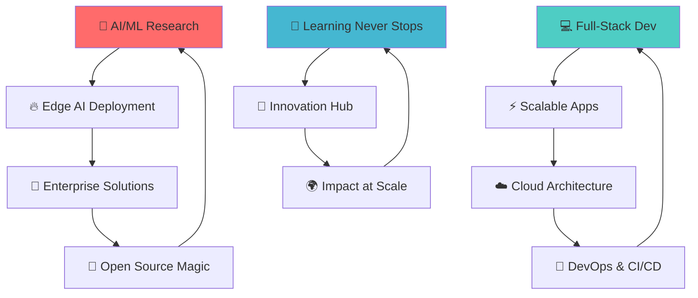

# 👋 Hey there! I'm Pranshu Chourasia 


[](https://pranshudev.xyz)
[](mailto:contact@pranshudev.xyz)
[](https://linkedin.com/in/pranshu-chourasia-615428275)
[](https://github.com/anshc022)


## 🎯 About Me


> **🚀 AI/ML Engineer & Full-Stack Developer** with **2+ IEEE research publications** and **$5500 grant funding**

🔥 I'm a passionate tech wizard who transforms coffee into code and ideas into reality! Currently brewing the perfect blend of **cutting-edge AI research** and **scalable full-stack solutions**.

### 🎪 Fun Facts About Me
- 🤖 I speak fluent **Python**, **JavaScript**, and **AI** 
- 🧠 My brain runs on **TensorFlow** and **React** 
- 🎯 I turn complex algorithms into simple solutions
- 🌟 **10+ Enterprise Apps** under my belt
- 💡 **25+ developers** learned from my wizardry
- 🎮 When not coding, I'm probably debugging my life

### 🏆 Achievement Unlocked
```
🔬 IEEE Researcher        ████████████████████ 100%
💰 Grant Funding ($5500)  ████████████████████ 100%
🚀 Entrepreneur           ████████████████████ 100%
👨‍🏫 Mentor               ████████████████████ 100%
🏅 Hackathon Winner       ████████████████████ 100%
```

---

## 💻 Tech Arsenal

## 💻 Tech Arsenal & Superpowers


### 🤖 AI/ML & Computer Vision


### 🎨 Frontend Wizardry


### ⚡ Backend Sorcery


### 🗄️ Database & Cloud Magic


### 🛠️ Tools & Weapons


---

## 📊 GitHub Analytics & Battle Stats


<table>
<tr>
<td>

</td>
<td>

</td>
</tr>
</table>

[](https://git.io/streak-stats)

### 🏆 GitHub Trophies
[](https://github.com/ryo-ma/github-profile-trophy)

### 📈 Contribution Graph
[](https://github.com/ashutosh00710/github-readme-activity-graph)

---

## 🏗️ Featured Projects & Epic Builds


### 🤖 AI/ML Projects That Rock

<table>
<tr>
<td width="50%">

#### 🌽 Smart Corn Seed Sorter
**💰 IEEE EPICS Funded ($5500)**


- **🎯 92% accuracy** in real-time classification
- **⚡ 10,000+ seeds/hour** processing speed
- 🔥 Edge AI deployment on **Raspberry Pi & Jetson Nano**
- 🧠 **YOLOv5/v8** + Custom CNN architecture

**Tech Stack:** `YOLOv5/v8` `Raspberry Pi` `Edge AI` `Computer Vision`

[](https://github.com/anshc022/smart-corn-sorter)

</td>
<td width="50%">

#### 🚨 Women Safety Analytics
**🏆 Smart India Hackathon 2024**


- **🎯 95% accuracy** in threat detection
- **📉 85% reduction** in false positives  
- 🎥 Real-time CCTV monitoring system
- 🧠 Multi-modal AI approach

**Tech Stack:** `YOLOv5` `MediaPipe` `OpenCV` `Face Recognition`

[](https://women-safety-demo.vercel.app)

</td>
</tr>
<tr>
<td width="50%">

#### 🛒 Flipkart Quality Analyzer
**🤖 GRiD 6.0 Robotics Challenge**


- **🎯 90% accuracy** across 10,000+ samples
- **📊 75% reduction** in manual inspection
- 🏭 Industrial automation solution
- 🔬 Computer vision + CNN implementation

**Tech Stack:** `Computer Vision` `CNN` `OpenCV` `SQL`

[](https://github.com/anshc022/Flipkart-Smart-Vision)

</td>
<td width="50%">

#### 🚦 Smart Traffic Management
**🚗 Minor Project with Nissan R&D**


- **📈 35% optimization** in traffic flow
- 🛣️ 50+ intersection simulations
- 📡 IoT sensor integration
- 🚙 Autonomous vehicle infrastructure

**Tech Stack:** `YOLOv5` `IoT` `OpenCV` `SQL`

[](https://github.com/anshc022/minor-industry)

</td>
</tr>
</table>

### 💻 Full-Stack Applications That Amaze

<table>
<tr>
<td width="50%">

#### ⛏️ TrackMine - SIH 2024
**🏆 National Level Project**


- 🏢 Coal sector project management for **CMPDI**
- ⚡ **500+ workflows** supported
- 📱 **React Native** mobile app with offline mode
- 🤖 **LLAMA 2** NLP integration for smart queries

**Tech Stack:** `React Native` `Node.js` `MongoDB` `PyTorch`

[](https://github.com/anshc022/TrackMine)
[](https://trackmine-demo.vercel.app)

</td>
<td width="50%">

#### 🤖 PRoPilot
**🚀 AI GitHub Automation**


- 🛠️ AI-powered GitHub workflow automation
- 👥 **500+ developers** actively using
- 💬 Intelligent commit message generation
- 📱 Real-time Telegram notifications

**Tech Stack:** `Node.js` `MongoDB` `GitHub API` `Telegram API`

[](https://p-ro-pilot.vercel.app)
[](https://github.com/anshc022/PRoPilot)

</td>
</tr>
<tr>
<td width="50%">

#### 💭 ThinkForge
**🧠 AI Debate Simulator**


- 🎭 AI debate with **20+ historical thinkers**
- 🎯 **95% historical authenticity** achieved
- ⚡ Real-time debate generation
- 🔍 Dual-phase contextual research pipeline

**Tech Stack:** `Next.js` `PostgreSQL` `LangChain` `Node.js`

[](https://devpost.com/thinkforge)
[](https://thinkforge-demo.vercel.app)

</td>
<td width="50%">

#### 📄 RoastMyResume
**🔥 AI Resume Roaster**


- 🤖 AI-powered resume feedback platform
- 👥 **2,000+ users** roasted their resumes
- ⭐ **92% satisfaction rating**
- 📎 Multi-format file processing magic

**Tech Stack:** `Next.js` `MongoDB` `LLM APIs` `REST APIs`

[](https://rostmyresume.xyz)
[](https://github.com/anshc022/RoastMyResume)

</td>
</tr>
</table>

---

## 🎓 Research & Publications That Matter


### 📚 IEEE Publications (Research Mode: ON 🔬)

<table>
<tr>
<td width="50%">


#### 🏠 "Smart Home User Action Prediction"
**📊 IEEE ICSADL 2025**

- 🎯 **DOI:** 10.1109/ICSADL65848.2025.10933179
- 📈 **39 Full Text Views** and counting!
- 🤖 Fast prediction system for autonomous homes
- 🔬 Published in sentiment analysis & deep learning

[](https://ieeexplore.ieee.org/document/10933179)

</td>
<td width="50%">


#### 🧬 "Chemical Biosensors for Real-Time Monitoring"
**⚗️ IEEE ICIMA 2025**

- 🔬 Real-time oxidative damage monitoring
- 📊 Human physiological signal analysis
- 🏆 Presented at 7th International Conference
- 📜 Conference presentation certificate earned

[](https://ieee-icima.org)

</td>
</tr>
</table>

### 🏆 Grants & Recognition Hall of Fame

```
💰 IEEE EPICS Grant - $5500      ████████████████████ 100%
🏅 Smart India Hackathon 2024    ████████████████████ 100%  
🥇 1st Prize - College Hackathon  ████████████████████ 100%
🥇 1st Prize - Ideation Comp      ████████████████████ 100%
🥈 2nd Prize - VISAI Event        ████████████████████ 100%
```

### 🎖️ Certifications & Achievements

**🤖 AI & Machine Learning Mastery**
- ✅ **AI Fundamentals** - Great Learning (Sep 2024)
- ✅ **MLOps Fundamentals** - Great Learning (Aug 2024)  
- ✅ **LLMs Specialization** - Google (Jun 2024)
- ✅ **Responsible AI** - Google (Jun 2024)

**💼 Professional Development**
- ✅ **Agile Project Management** - HP (Oct 2024)
- ✅ **Cybersecurity Fundamentals** - HP (Oct 2024)
- ✅ **Infosys Duelist Certified** - Infosys (Jun 2024)

**🏆 Competition Victories**
- 🥇 **HP Power Lab Winner** - Unstop (Jan 2025)
- 🥇 **Infosys Ideathon Winner** - Infosys (Sep 2024)
- 🥇 **Flipkart GRiD 6.0 Finalist** - Unstop (Aug 2024)
- 🎤 **IEEE Presenter** - ICSADL (Feb 2025)

---

## 💼 Professional Experience

### 🚀 Current Roles

**MERN Stack Developer @ Upwork (Remote)** *(May 2024 - Present)*
- Developed **10+ enterprise management systems**
- **99.9% uptime** with 1K+ daily requests
- **75% reduction** in deployment time via CI/CD
- **AWS/Vercel** production deployments

**AI/ML Project Lead @ Vel Tech R&D** *(2023 - Present)*
- Led **15+ institutional AI/ML projects**
- **$5500 IEEE EPICS grant** secured
- **90%+ accuracy** across 8 production deployments
- Mentored **25+ junior developers**

### 💡 Entrepreneurial Success

**Founder @ GrafikGalore.live** *(2023-2024)*
- **₹45,900 revenue** in 3 months
- **300+ monthly orders**
- **1,200+ customers** served
- **40% conversion rate** optimization

---

## 🎯 Current Focus & What's Brewing




### 🔭 What I'm Cooking Right Now:
- 🤖 **Advanced Computer Vision** models for industrial automation
- 🌐 **Microservices architecture** that scales like crazy
- 📱 **Cross-platform mobile apps** with React Native
- 🔬 **IoT healthcare systems** for remote monitoring
- 🧠 **LLM integration** in real-world applications

### 🌱 Currently Learning & Exploring:
- 🧠 **Advanced Deep Learning** architectures (Transformers, GANs)
- ☁️ **Cloud-native development** patterns & Kubernetes
- 🔐 **Cybersecurity best practices** & ethical hacking
- 📊 **Data engineering pipelines** with Apache Spark
- 🌟 **Web3 & Blockchain** integration possibilities

### 🎮 Fun Side Quests:
- 🎨 Contributing to **open-source AI tools**
- 🎓 **Mentoring** the next generation of developers
- 📝 **Technical writing** & knowledge sharing
- 🎪 Building **quirky side projects** for fun

---

## 📈 Impact & Metrics That Speak Volumes


<table>
<tr>
<td width="50%">

### 🏆 Achievement Dashboard
| Metric | Achievement | Progress |
|--------|-------------|----------|
| 🔬 **Research Publications** | 2 IEEE Papers | ████████████████████ |
| 💰 **Grant Funding** | $5500 IEEE EPICS | ████████████████████ |
| 👥 **Developers Mentored** | 25+ | ████████████████████ |
| 🚀 **Enterprise Apps** | 10+ Delivered | ████████████████████ |

</td>
<td width="50%">

### 📊 Performance Stats
| Metric | Achievement | Progress |
|--------|-------------|----------|
| 📊 **Daily Users Served** | 1000+ | ████████████████████ |
| ⚡ **System Uptime** | 99.9% | ████████████████████ |
| 💼 **Revenue Generated** | ₹45,900 | ████████████████████ |
| 🎯 **AI Model Accuracy** | 90%+ Average | ████████████████████ |

</td>
</tr>
</table>

### 🎮 Level Up Statistics

```
🎓 Education Level: B.Tech Computer Science     ████████████████████ 100%
💻 Coding Experience: 3+ Years                 ████████████████████ 100%  
🤖 AI/ML Expertise: Advanced                   ████████████████████ 100%
🏗️ Full-Stack Skills: Expert                   ████████████████████ 100%
👥 Leadership: Team Lead                       ████████████████████ 100%
🚀 Entrepreneurship: Proven Success            ████████████████████ 100%
```

### 🌟 Quick Flex
- 💡 **25+ developers** learned from my guidance
- 🏆 **Multiple hackathon victories** under my belt
- 📚 **2 IEEE research papers** published
- 💰 **$5500 grant funding** secured through proposals
- 🚀 **₹45,900 revenue** generated as entrepreneur
- 🎯 **99.9% uptime** maintained across all applications

---

## 🤝 Let's Connect & Build Something Epic!


**🚀 Ready to collaborate on the next big thing?** 

I'm always buzzing with excitement for innovative projects, especially those involving:

🔬 **AI/ML Research & Development** | 💻 **Full-Stack Web Applications** | 🤖 **Computer Vision Solutions** | 📱 **Mobile App Development**

### 🌟 Let's Create Magic Together!

Whether you're looking for:
- 🔬 **Research Collaboration** on cutting-edge AI projects
- 💼 **Enterprise Solutions** that scale globally  
- 🚀 **Startup MVP Development** from idea to reality
- 🎓 **Technical Mentoring** to level up your skills
- 🏆 **Hackathon Partnership** to dominate competitions

**I'm your go-to tech wizard! ⚡**

[](https://pranshudev.xyz)
[](mailto:contact@pranshudev.xyz)
[](https://linkedin.com/in/pranshu-chourasia-615428275)
[](https://calendly.com/pranshudev)
[](https://twitter.com/anshc022)
[](https://discord.gg/pranshudev)

---

### 🎯 "From AI Research Papers to Production-Ready Apps"
### 💫 "Building the Future, One Algorithm at a Time"


[](https://github.com/anshc022)
[](https://github.com/anshc022)

---

### 🐍 Watch My Contributions Get Devoured!


---

<sub>💙 **Made with lots of ☕ and late-night coding sessions**</sub>  
<sub>🚀 **Last updated: August 2025 - Always evolving!**</sub>