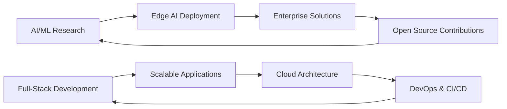

  
# 👋 Hey there! I'm Pranshu Chourasia

---

## 🚀 About Me

> **AI/ML Engineer & Full-Stack Developer** with **2+ IEEE research publications** and **$5500 grant funding**

I'm a passionate technologist who bridges the gap between cutting-edge AI research and practical full-stack development. With expertise spanning from **computer vision (YOLOv5/v8)** to **scalable MERN applications**, I've successfully delivered enterprise solutions serving **1000+ daily users** while maintaining **99.9% uptime**.

### 🏆 Quick Highlights
- 🔬 **2 IEEE Research Publications** in IoT & Biosensors
- 💰 **$5500 IEEE EPICS Grant** recipient
- 🚀 **Entrepreneur** with **₹45,900 revenue** generated
- 👨‍🏫 **Mentored 25+ developers**
- 🏅 **Smart India Hackathon** participant
- 🌟 **10+ Enterprise Applications** delivered

---

## 💻 Tech Arsenal

### 🤖 AI/ML & Computer Vision

### 🎨 Frontend Development

### ⚡ Backend Development

### 🗄️ Database & Cloud

---

## 📊 GitHub Analytics

  

  

---

## 🏗️ Featured Projects

### 🎯 AI/ML Projects

<table>
<tr>
<td width="50%">

#### 🌽 Smart Corn Seed Sorter
**IEEE EPICS Funded ($5500)**
- **92% accuracy** in real-time classification
- **10,000+ seeds/hour** processing
- Edge AI deployment on **Raspberry Pi & Jetson Nano**
- **YOLOv5/v8** + Custom CNN architecture

**Tech:** `YOLOv5/v8` `Raspberry Pi` `Edge AI` `Computer Vision`

</td>
<td width="50%">

#### 🚨 Women Safety Analytics
**Smart India Hackathon 2024**
- **95% accuracy** in threat detection
- **85% reduction** in false positives
- Real-time CCTV monitoring system
- Multi-modal AI approach

**Tech:** `YOLOv5` `MediaPipe` `OpenCV` `Face Recognition`

</td>
</tr>
<tr>
<td width="50%">

#### 🛒 Flipkart Quality Analyzer
**GRiD 6.0 Robotics Challenge**
- **90% accuracy** across 10,000+ samples
- **75% reduction** in manual inspection
- Industrial automation solution
- Computer vision + CNN implementation

**Tech:** `Computer Vision` `CNN` `OpenCV` `SQL`

</td>
<td width="50%">

#### 🚦 Smart Traffic Management
**Minor Project with Nissan R&D**
- **35% optimization** in traffic flow
- 50+ intersection simulations
- IoT sensor integration
- Autonomous vehicle infrastructure

**Tech:** `YOLOv5` `IoT` `OpenCV` `SQL`

</td>
</tr>
</table>

### 💻 Full-Stack Applications

<table>
<tr>
<td width="50%">

#### ⛏️ TrackMine - SIH 2024

- Coal sector project management for **CMPDI**
- **500+ workflows** supported
- **React Native** mobile app with offline functionality
- **LLAMA 2** NLP integration

**Tech:** `React Native` `Node.js` `MongoDB` `PyTorch`

</td>
<td width="50%">

#### 🤖 PRoPilot

- AI-powered GitHub workflow automation
- **500+ developers** served
- Intelligent commit message generation
- Real-time notifications

**Tech:** `Node.js` `MongoDB` `GitHub API` `Telegram API`

</td>
</tr>
<tr>
<td width="50%">

#### 💭 ThinkForge

- AI debate simulator with **20+ historical thinkers**
- **95% historical authenticity**
- Real-time debate generation
- Dual-phase contextual pipeline

**Tech:** `Next.js` `PostgreSQL` `LangChain` `Node.js`

</td>
<td width="50%">

#### 📄 RoastMyResume

- AI resume feedback platform
- **2,000+ users** served
- **92% satisfaction rating**
- Multi-format file processing

**Tech:** `Next.js` `MongoDB` `LLM APIs` `REST APIs`

</td>
</tr>
</table>

---

## 🎓 Research & Publications

### 📚 IEEE Publications

1. **"Development of Fast Prediction System of User Action for a Fully Autonomous Smart Home System"**
   - *IEEE ICSADL 2025*
   - DOI: 10.1109/ICSADL65848.2025.10933179
   - **39 Full Text Views**

2. **"Real-Time Monitoring of Oxidative Damage and Physiological Signals using Chemical Biosensors"**
   - *IEEE ICIMA 2025*
   - 7th International Conference on Inventive Material Science

### 🏆 Grants & Recognition
- **$5500 IEEE EPICS Grant** for Smart Corn Seed Sorter
- **Smart India Hackathon 2024** Participant
- **1st Prize** - College Hackathon 2024
- **Multiple Hackathon Winner** - 2023-2024

---

## 💼 Professional Experience

### 🚀 Current Roles

**MERN Stack Developer @ Upwork (Remote)** *(May 2024 - Present)*
- Developed **10+ enterprise management systems**
- **99.9% uptime** with 1K+ daily requests
- **75% reduction** in deployment time via CI/CD
- **AWS/Vercel** production deployments

**AI/ML Project Lead @ Vel Tech R&D** *(2023 - Present)*
- Led **15+ institutional AI/ML projects**
- **$5500 IEEE EPICS grant** secured
- **90%+ accuracy** across 8 production deployments
- Mentored **25+ junior developers**

### 💡 Entrepreneurial Success

**Founder @ GrafikGalore.live** *(2023-2024)*
- **₹45,900 revenue** in 3 months
- **300+ monthly orders**
- **1,200+ customers** served
- **40% conversion rate** optimization

---

## 🎯 Current Focus & Goals

### 🔭 What I'm working on:
- 🤖 Advanced Computer Vision models for industrial automation
- 🌐 Scalable microservices architecture
- 📱 Cross-platform mobile applications
- 🔬 IoT systems for healthcare monitoring

### 🌱 What I'm learning:
- 🧠 Advanced Deep Learning architectures
- ☁️ Cloud-native development patterns
- 🔐 Cybersecurity best practices
- 📊 Data engineering pipelines

---

## 📈 Impact & Metrics

| Metric | Achievement |
|--------|-------------|
| 🏆 **Research Publications** | 2 IEEE Papers |
| 💰 **Grant Funding** | $5500 IEEE EPICS |
| 👥 **Developers Mentored** | 25+ |
| 🚀 **Enterprise Apps** | 10+ Delivered |
| 📊 **Daily Users Served** | 1000+ |
| ⚡ **System Uptime** | 99.9% |
| 💼 **Revenue Generated** | ₹45,900 |
| 🎯 **AI Model Accuracy** | 90%+ Average |

---

## 🤝 Let's Connect & Collaborate!

I'm always excited to work on innovative projects, especially those involving **AI/ML**, **computer vision**, or **full-stack development**. Whether you're looking for:

🔬 **Research Collaboration** | 💼 **Enterprise Solutions** | 🚀 **Startup Projects** | 🎓 **Mentoring**

**Let's build something amazing together!**

---

### 🎯 "Bridging AI Research with Real-World Solutions"

*Building the future, one algorithm at a time* ⚡

---

