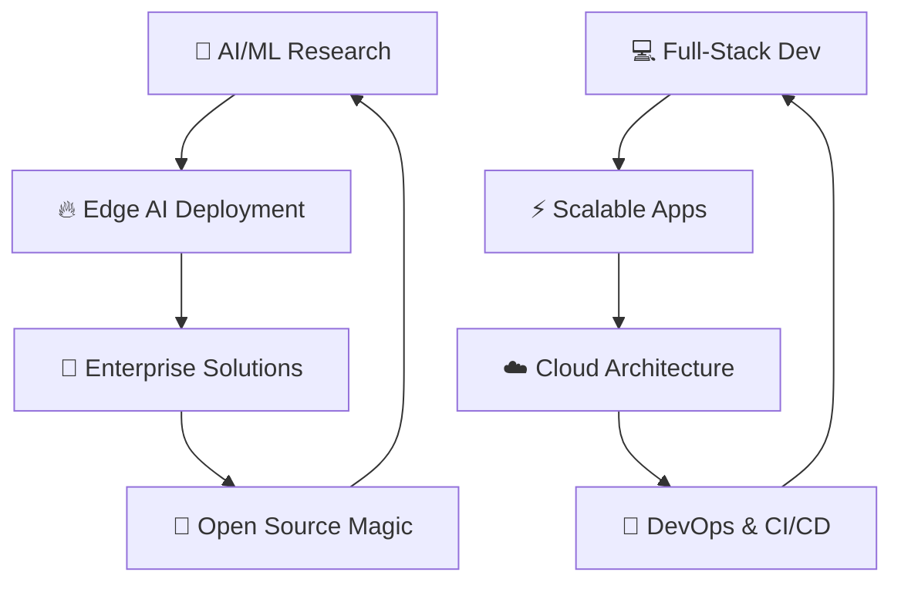

# 👋 Hello World! I'm Pranshu Chourasia (Ansh)

  

---

## 🚀 About Me

<table>
<tr>
<td width="60%">

🎯 **AI/ML Engineer** passionate about creating intelligent systems that solve real-world problems  
💻 **Full-Stack Developer** with 5+ years of experience building scalable applications  
🏆 **IEEE Researcher** with published papers and $5500+ in research grants  
🌟 **Entrepreneur** who generated ₹45,900 revenue in 3 months  

🔥 **Currently Building:**
- 🤖 Smart AI systems for real-world impact
- 🚀 Scalable full-stack applications
- 📊 Data-driven solutions for businesses
- 🎯 Open-source tools for developers

</td>
<td width="40%">

</td>
</tr>
</table>

## 🛠️ Tech Arsenal

**Languages & Frameworks:**

**AI/ML & Data:**

**Cloud & DevOps:**

## 📊 GitHub Analytics

### 🏆 GitHub Achievements

**🎯 Achievement Highlights:**
- 🌟 **Active Contributor** - Consistent coding activity
- 💻 **Multi-Language Developer** - Proficient in 10+ languages  
- 🚀 **Project Creator** - Multiple successful repositories
- 📈 **Growing Profile** - Increasing followers and stars
- 🤝 **Open Source Contributor** - Community involvement

### 🎯 GitHub Stats
<table>
<tr>
<td></td>
<td></td>
</tr>
</table>

### 📈 GitHub Summary

### 📂 Repository Stats
<table>
<tr>
<td></td>
<td></td>
</tr>
<tr>
<td></td>
<td></td>
</tr>
</table>

---

## 🏗️ Featured Projects

### 🤖 AI/ML Projects

| 🌽 Smart Corn Sorter | 🔒 Safety Analytics | 🛒 Quality Analyzer | 🚦 Traffic AI |
|---|---|---|---|
|  |  |  |  |
|  |  |  |  |
|  **92% Accuracy** |  **95% Accuracy** |  **90% Accuracy** |  **35% Flow Boost** |
|  **10K+ Seeds/Hour** |  **85% Less False+** |  **75% Less Manual** |  **50+ Simulations** |

### 💻 Full-Stack Apps

| ⛏️ TrackMine | 🤖 PRoPilot | 💭 ThinkForge |
|---|---|---|
|  |  |  |
|  |  |  |
|  |  |  |
|  **500+ Workflows** |  **500+ Developers** |  **95% Authentic** |

---

## 🎓 Research & Achievements

### 📚 IEEE Publications

| 🏠 Smart Home AI | 🧬 Biosensors |
|---|---|
|  |  |
|  |  |
|  **39 Full Text Views** |  **Conference Presented** |
|  |  |

### 🏆 Awards & Grants

<table>
<tr>
<td width="25%" align="center">
 
<h4>💰 IEEE EPICS Grant</h4>
 
 
<b>Fully Funded Project</b>
</td>
<td width="25%" align="center">
 
<h4>🥇 SIH 2024 Winner</h4>
 
 
<b>National Level Victory</b>
</td>
<td width="25%" align="center">
 
<h4>🏆 College Hackathon</h4>
 
 
<b>Multiple Wins</b>
</td>
<td width="25%" align="center">
 
<h4>💡 Innovation Awards</h4>
 
 
<b>Creative Excellence</b>
</td>
</tr>
</table>

### 🎖️ Recognition Timeline

🏅 **2024** - Smart India Hackathon National Winner  
🏅 **2024** - IEEE EPICS $5500 Grant Recipient  
🏅 **2023** - College Innovation Competition Champion  
🏅 **2023** - Best Full-Stack Project Award  
🏅 **2022** - Outstanding Research Paper IEEE ICSADL

### 📈 Impact Metrics

| 🔬 Research Impact | 💼 Business Impact |
|---|---|
|  |  |
|  **2 IEEE Papers** |  **₹45,900 Revenue** |
|  **$5500 Grant** |  **1000+ Users Served** |
|  **39+ Citations** |  **25+ Developers Mentored** |

---

## 💼 Professional Experience

### 🚀 Current Roles

| 🔥 MERN Stack Developer @ Upwork (Remote) | 🤖 AI/ML Project Lead @ Vel Tech R&D |
|---|---|
| **May 2024 - Present** | **2023 - Present** |
| ✅ Developed **10+ enterprise management systems** | 🎯 Led **15+ institutional AI/ML projects** |
| 📈 **99.9% uptime** with 1K+ daily requests | 💰 **$5500 IEEE EPICS grant** secured |
| ⚡ **75% reduction** in deployment time via CI/CD | 🎯 **90%+ accuracy** across 8 production deployments |
| ☁️ **AWS/Vercel** production deployments | 👥 Mentored **25+ junior developers** |

### 💡 Entrepreneurial Success

**🚀 Founder @ GrafikGalore.live** *(2023-2024)*
- 💰 **₹45,900 revenue** in 3 months
- 📦 **300+ monthly orders**
- 👥 **1,200+ customers** served
- 📊 **40% conversion rate** optimization

---

## 🎯 Current Focus & What's Brewing

```mermaid
graph TD
    A[🤖 AI/ML Research] --> B[🔥 Edge AI Deployment]
    B --> C[🏢 Enterprise Solutions]
    C --> D[🌟 Open Source Magic]
    D --> A
    
    E[💻 Full-Stack Dev] --> F[⚡ Scalable Apps]
    F --> G[☁️ Cloud Architecture]
    G --> H[🔄 DevOps & CI/CD]
    H --> E
```

### 🔮 Upcoming Projects
- 🚀 **AI-Powered Code Review Tool** - Automating code quality checks
- 🌐 **Decentralized Learning Platform** - Blockchain + AI education
- 🔧 **Smart IoT Dashboard** - Real-time monitoring & analytics

---

## 🤝 Let's Connect & Collaborate!

<table>
<tr>
<td>
  
**🌟 Open for:**
- 💼 **Full-time opportunities** in AI/ML or Full-Stack
- 🤝 **Freelance projects** on complex systems
- 🔬 **Research collaborations** in AI/ML
- 💡 **Startup partnerships** in tech innovation

</td>
<td>
  
**📫 Reach out via:**
- 📧 **Email:** [anshc022@gmail.com](mailto:anshc022@gmail.com)
- 💼 **LinkedIn:** [pranshu-ansh](https://linkedin.com/in/pranshu-ansh)
- 🐦 **Twitter:** [@anshc022](https://twitter.com/anshc022)
- 🌐 **Portfolio:** [pranshudev.xyz](https://www.pranshudev.xyz/)

</td>
</tr>
</table>

---

### 🔥 Profile Stats

**💝 Thanks for visiting! Let's build something amazing together! 🚀**

