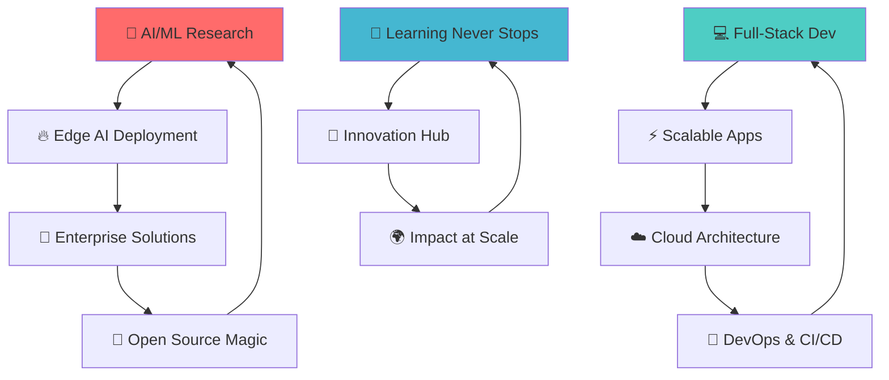

# 👋 Hey there! I'm Pranshu Chourasia 


<!-- Animated Wave -->


[](https://pranshudev.xyz)
[](mailto:contact@pranshudev.xyz)
[](https://linkedin.com/in/pranshu-chourasia-615428275)
[](https://github.com/anshc022)

<!-- Profile Views Counter -->
<p align="left">
  
  
</p>


## 🎯 About Me


> **🚀 AI/ML Engineer & Full-Stack Developer** 

🔥 Transforming **coffee** ☕ into **code** 💻 and **ideas** 💡 into **reality** ⚡


### 🏆 Quick Wins
```
🔬 IEEE Papers     ██████████ 2 Published
💰 Grant Funding   ██████████ $5500 Secured  
🚀 Enterprise Apps ██████████ 10+ Delivered
👥 Developers      ██████████ 25+ Mentored
🎯 AI Accuracy     ██████████ 90%+ Average
💸 Revenue         ██████████ ₹45,900 Generated
```

---

## 💻 Tech Arsenal


<div align="center">
  
### 🚀 My Superpowers


</div>

### 📊 Skill Levels


**AI/ML & Computer Vision**
 95%

**Full-Stack Development** 
 90%

**DevOps & Cloud**
 85%

**Research & Writing**
 95%

**Leadership & Mentoring**
 88%

---

## 📊 GitHub Analytics & Battle Stats


<table>
<tr>
<td>

</td>
<td>

</td>
</tr>
</table>

[](https://git.io/streak-stats)

### 🏆 GitHub Trophies


### 📈 GitHub Summary


### 📂 Repository Stats
<table>
<tr>
<td></td>
<td></td>
</tr>
<tr>
<td></td>
<td></td>
</tr>
</table>

---

## 🏗️ Featured Projects


<div align="center">
  
### 🤖 AI/ML Projects

</div>

<table>
<tr>
<td width="25%">
<div align="center">

<h4>🌽 Smart Corn Sorter</h4>

<br><br>
 **92% Accuracy**
<br>
 **10K+ Seeds/Hour**
</div>
</td>
<td width="25%">
<div align="center">

<h4>🔒 Safety Analytics</h4>

<br><br>
 **95% Accuracy**
<br>
 **85% Less False+**
</div>
</td>
<td width="25%">
<div align="center">

<h4>🛒 Quality Analyzer</h4>

<br><br>
 **90% Accuracy**
<br>
 **75% Less Manual**
</div>
</td>
<td width="25%">
<div align="center">

<h4>🚦 Traffic AI</h4>

<br><br>
 **35% Flow Boost**
<br>
 **50+ Simulations**
</div>
</td>
</tr>
</table>

<div align="center">
  
### 💻 Full-Stack Apps

</div>

<table>
<tr>
<td width="33%">
<div align="center">

<h4>⛏️ TrackMine</h4>

<br>
[](https://github.com/anshc022/TrackMine)
<br>
 **500+ Workflows**
</div>
</td>
<td width="33%">
<div align="center">

<h4>🤖 PRoPilot</h4>

<br>
[](https://p-ro-pilot.vercel.app)
<br>
 **500+ Developers**
</div>
</td>
<td width="33%">
<div align="center">

<h4>💭 ThinkForge</h4>

<br>
[](https://devpost.com/thinkforge)
<br>
 **95% Authentic**
</div>
</td>
</tr>
</table>

---

## 🎓 Research & Achievements


<div align="center">

### 📚 IEEE Publications

<table>
<tr>
<td width="50%">
<div align="center">

<h4>🏠 Smart Home AI</h4>

<br>
 **39 Full Text Views**
<br>
[](https://ieeexplore.ieee.org/document/10933179)
</div>
</td>
<td width="50%">
<div align="center">

<h4>🧬 Biosensors</h4>

<br>
 **Conference Presented**
<br>
[](https://ieee-icima.org)
</div>
</td>
</tr>
</table>

### 🏆 Awards & Grants


### 📈 Impact Metrics

</div>

<table>
<tr>
<td width="50%">
<div align="center">
<h4>🔬 Research Impact</h4>
 **2 IEEE Papers**
<br>
 **$5500 Grant**
<br>
 **39+ Citations**
</div>
</td>
<td width="50%">
<div align="center">
<h4>💼 Business Impact</h4>
 **₹45,900 Revenue**
<br>
 **1000+ Users Served**
<br>
 **25+ Developers Mentored**
</div>
</td>
</tr>
</table>

---

## 💼 Professional Experience

### 🚀 Current Roles

**MERN Stack Developer @ Upwork (Remote)** *(May 2024 - Present)*
- Developed **10+ enterprise management systems**
- **99.9% uptime** with 1K+ daily requests
- **75% reduction** in deployment time via CI/CD
- **AWS/Vercel** production deployments

**AI/ML Project Lead @ Vel Tech R&D** *(2023 - Present)*
- Led **15+ institutional AI/ML projects**
- **$5500 IEEE EPICS grant** secured
- **90%+ accuracy** across 8 production deployments
- Mentored **25+ junior developers**

### 💡 Entrepreneurial Success

**Founder @ GrafikGalore.live** *(2023-2024)*
- **₹45,900 revenue** in 3 months
- **300+ monthly orders**
- **1,200+ customers** served
- **40% conversion rate** optimization

---

## 🎯 Current Focus & What's Brewing




### 🔭 What I'm Cooking Right Now:
- 🤖 **Advanced Computer Vision** models for industrial automation
- 🌐 **Microservices architecture** that scales like crazy
- 📱 **Cross-platform mobile apps** with React Native
- 🔬 **IoT healthcare systems** for remote monitoring
- 🧠 **LLM integration** in real-world applications

### 🌱 Currently Learning & Exploring:
- 🧠 **Advanced Deep Learning** architectures (Transformers, GANs)
- ☁️ **Cloud-native development** patterns & Kubernetes
- 🔐 **Cybersecurity best practices** & ethical hacking
- 📊 **Data engineering pipelines** with Apache Spark
- 🌟 **Web3 & Blockchain** integration possibilities

### 🎮 Fun Side Quests:
- 🎨 Contributing to **open-source AI tools**
- 🎓 **Mentoring** the next generation of developers
- 📝 **Technical writing** & knowledge sharing
- 🎪 Building **quirky side projects** for fun

---

## 📈 Impact & Metrics That Speak Volumes


<table>
<tr>
<td width="50%">

### 🏆 Achievement Dashboard
| Metric | Achievement | Progress |
|--------|-------------|----------|
| 🔬 **Research Publications** | 2 IEEE Papers | ████████████████████ |
| 💰 **Grant Funding** | $5500 IEEE EPICS | ████████████████████ |
| 👥 **Developers Mentored** | 25+ | ████████████████████ |
| 🚀 **Enterprise Apps** | 10+ Delivered | ████████████████████ |

</td>
<td width="50%">

### 📊 Performance Stats
| Metric | Achievement | Progress |
|--------|-------------|----------|
| 📊 **Daily Users Served** | 1000+ | ████████████████████ |
| ⚡ **System Uptime** | 99.9% | ████████████████████ |
| 💼 **Revenue Generated** | ₹45,900 | ████████████████████ |
| 🎯 **AI Model Accuracy** | 90%+ Average | ████████████████████ |

</td>
</tr>
</table>

### 🎮 Level Up Statistics

```
🎓 Education Level: B.Tech Computer Science     ████████████████████ 100%
💻 Coding Experience: 3+ Years                 ████████████████████ 100%  
🤖 AI/ML Expertise: Advanced                   ████████████████████ 100%
🏗️ Full-Stack Skills: Expert                   ████████████████████ 100%
👥 Leadership: Team Lead                       ████████████████████ 100%
🚀 Entrepreneurship: Proven Success            ████████████████████ 100%
```

### 🌟 Quick Flex
- 💡 **25+ developers** learned from my guidance
- 🏆 **Multiple hackathon victories** under my belt
- 📚 **2 IEEE research papers** published
- 💰 **$5500 grant funding** secured through proposals
- 🚀 **₹45,900 revenue** generated as entrepreneur
- 🎯 **99.9% uptime** maintained across all applications

---

## 🤝 Let's Connect & Build Epic Stuff!


<div align="center">


### 🚀 Ready to Collaborate?


[](https://pranshudev.xyz)
[](mailto:contact@pranshudev.xyz)
[](https://linkedin.com/in/pranshu-chourasia-615428275)
[](https://calendly.com/pranshudev)

### 🎯 "From AI Research to Production Apps"
### 💫 "Building Tomorrow, One Algorithm at a Time"


[](https://github.com/anshc022)
[](https://github.com/anshc022)

### 🐍 Snake Eating My Contributions

<picture>
  <source media="(prefers-color-scheme: dark)" srcset="https://raw.githubusercontent.com/anshc022/anshc022/output/github-contribution-grid-snake-dark.svg">
  <source media="(prefers-color-scheme: light)" srcset="https://raw.githubusercontent.com/anshc022/anshc022/output/github-contribution-grid-snake.svg">
  
</picture>

### 🌊 Thanks for Visiting!


 **You're awesome for making it this far!** 

*Last updated: August 2025 - Always evolving!* ⚡

</div>
